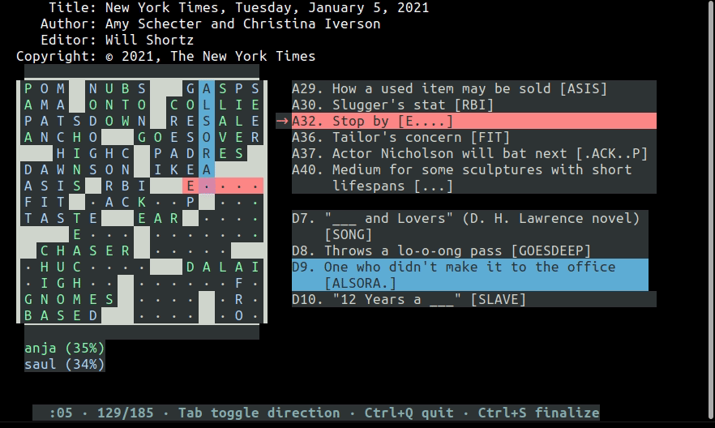

# Crossword Player

A compact and colorful terminal interface for solving crossword puzzles.



- requires Python3 (no external library dependencies)
- works in classic 80x25 terminal size (up to 21x21 puzzle)
- requires 256-color terminal
- supports crosswords in [.xd format](https://www.youtube.com/watch?v=9aHfK8EUIzg) and AcrossLite .puz format
- Install: `pip3 install git+https://github.com/devottys/xdplayer.git`
- Usage: `xdplayer <file.xd|file.puz>`

There are some crosswords to play with in `samples/` and a collection of xds on [xd.saul.pw/data](https://xd.saul.pw/data).

## Keyboard Commands

- Arrow keys: move cursor
- click on a grid square or a clue to jump to that location in the grid

- Letter or number: fill in grid at cursor
- Backspace, Space, Delete: erase backward, forward, in-place
- TAB: change fill direction (across/down)

xdplayer *autosaves* your progress. It will create and restore from a **crosswordfilename-guesses.jsonl**
in the current directory or in the location set by the `$TEAMDIR` shell environment variable.

- Ctrl+S: commits to and checks your solution. The **crosswordfilename-guesses.jsonl** will be set to read-only, and "wrong" entries will be underlined.
- Ctrl+X: enable hotkeys to cycle through display configurable options. These options are all set at the top of `xdplayer/__init__.py`, should you wish to modify them.
- Ctrl+Q: quit program.

## Installation Guide

### How to set-up basic xdplayer (TODO)

### Celebrate!

To optionally celebrate every time you have successfully completed a puzzle, install the "celebrate" [extras](https://packaging.python.org/en/latest/tutorials/installing-packages/#installing-setuptools-extras).

```
pip3 install .[celebrate]
```

Or seperately install the PyPi package [playsound](https://pypi.org/project/playsound/) in the current Python environment.

```
pip3 install playsound
```


## Similar Projects

- [puzterm](https://github.com/rparrett/puzterm) (2018, Rust)
- [cursewords](https://github.com/thisisparker/cursewords) (2019, Python)
