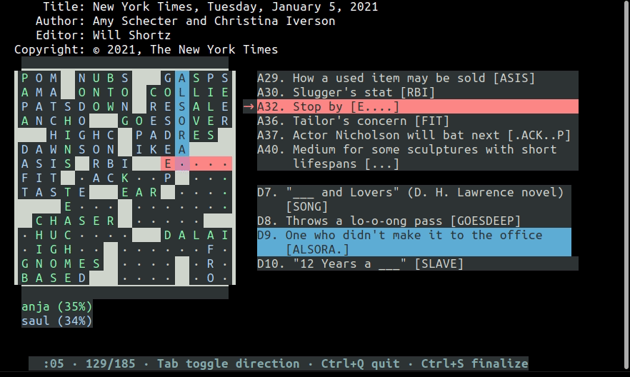

# Crossword Player

A compact and colorful terminal interface for solving crossword puzzles.

- very small terminal form factor
  - can play 21x21 sunday puzzles in classic 80x25 terminal size
  - can play huge puzzles like nyt mega 50x50 in larger terminals
- supports crosswords in [.xd format](https://github.com/century-arcade/xd/) and AcrossLite .puz format
- supports multiple players and stats
- notes attached to individual clues

## Requirements

- Python3.8 (no external library dependencies)
- 256-color terminal

## Install

`pip3 install git+https://github.com/devottys/xdplayer.git`

## Usage

`xdplayer <file.xd|file.puz>`

There are some crosswords to play with in `samples/` and a collection of xds on [xd.saul.pw/data](https://xd.saul.pw/data).

xdplayer *autosaves* your progress. It will create and restore from a **crosswordfilename-guesses.jsonl**
in the current directory or in the location set by the `$TEAMDIR` shell environment variable.

## Keyboard Commands

### Navigation
- Click on a grid square or a clue: jump to that position in the grid.
- Arrow keys: move cursor to next grid position.
- Shift+{Left,Right}Arrow: move to next clue in current fill direction.
- Tab: change fill direction (across <-> down).

### Solving
- Letter or number: fill in grid position at cursor.
- Backspace, Space, Delete: erase backward, forward, in-place.
- Ctrl+R: insert rebus key in grid position at cursor; at the prompt, either add a new rebus word or enter the numeric key of a previously-added word.
- Ctrl+S: commits to and checks your solution. The **crosswordfilename-guesses.jsonl** will be set to read-only, and "wrong" entries will be underlined.

### Meta
- Ctrl+X: enable hotkeys to cycle through display configurable options. These options are all set at the top of `xdplayer/__init__.py`, should you wish to modify them.
- Ctrl+Y: add a note to the current clue.
- Ctrl+F/Ctrl+B or PageUp/PageDown: scroll forwards/backwards through notes for current clue.
- Ctrl+N: move to the next puzzle.
- Ctrl+Q: quit program.

## Similar Projects
- [puzterm](https://github.com/rparrett/puzterm) (2018, Rust)
- [cursewords](https://github.com/thisisparker/cursewords) (2019, Python)

## References
- [How a Crossword Format Led to a Crossword Scandal](https://www.youtube.com/watch?v=9aHfK8EUIzg)
